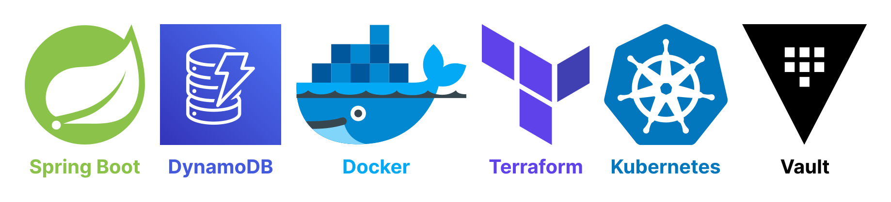

# Java Spring Boot + AWS DynamoDB



This example demonstrates a working backend application built in Java Spring Boot 3+
and uses a NOSQL AWS DynamoDB database, provisioned by Terraform.

The focus of this example is integration and manipulation with DynamoDB.

# 0. Technologies used:

- Java Spring Boot: **v3.1.4**
- Docker: **v24.0.6**
- Docker Compose: **v2.21.0-desktop.1**
- Kubernetes minikube: **v1.31.2**
- Kubernetes kubectl: **v1.28.2**
- Terraform: **v1.5.7**

# 1. Getting Started

This guide will explain everything you need to do to run this backend demo.

## 1.1. Create DynamoDB via Terraform

Create and configure DynamoDB:

```shell
cd ./terraform
terraform init
terraform apply --auto-approve
```

- **Note:** don't forget to destroy everything when you're done testing:

```shell
terraform destroy --auto-approve
```

# 2. Run the backend application

There are several ways to run it.

## 2.1. Manual

Open the project manually via IntelliJ and run it.

## 2.2. Docker

First of all, generate a JAR file from the current backend:

```shell
./gradlew clean build
```

To utilize the Dockerfile, build an image of this backend:

```shell
docker build -t spring-boot-dynamodb-demo .
```

Verify the image has been created:

```shell
docker image ls
```

Run the Docker Container from that image:

```shell
docker run --rm -d -p 8081:8081 --name spring-boot-dynamodb spring-boot-dynamodb-demo
```

## 2.3. JIB

Generate a JAR file of the backend and build a Docker image around it using the JIB plugin:

```shell
./gradlew clean build jibDockerBuild
```

Run the container from the generated image:

```shell
docker run --rm -d -p 8081:8081 --name spring-boot-dynamodb spring-boot-dynamodb-demo
```

## 2.4. Docker Compose

Run the backend via Docker Compose:

```shell
docker compose -up -d
```

## 2.5. Kubernetes

First of all, build a brand-new JAR file of the backend:

```shell
./gradlew clean build
```

Now build a Docker image (must be uploaded to DockerHub):

```shell
docker build -t milanobrenovic/spring-boot-dynamodb-demo:latest .
```

Push to DockerHub:

```shell
docker push milanobrenovic/spring-boot-dynamodb-demo:latest
```

Start the minikube:

```shell
minikube start
```

Apply the deployment and service in k8s folder:

```shell
cd ./k8s
kubectl apply -f deployment.yaml
kubectl apply -f service.yaml
```

Verify that the pods are running:

```shell
kubectl get pods
```

View one of the pod logs to verify that the backend is running:

```shell
kubectl logs spring-boot-dynamodb-b69ffdf77-ms92b
```

Verify that the service has been created:

```shell
kubectl get svc
```

Connect to deployment:

```shell
kubectl port-forward deployment/spring-boot-dynamodb 8081:8081
```

Try to access the same (localhost) API, such as:

```shell
[GET] http://localhost:8081/api/v1/notes
```

# 3. Testing the CRUD API


Import the [spring-boot-dynamodb.postman_collection.json](postman/spring-boot-dynamodb.postman_collection.json) file
into the Postman.
